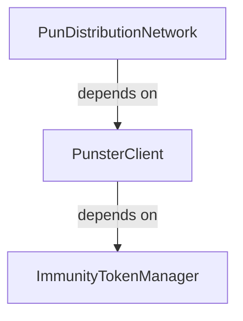
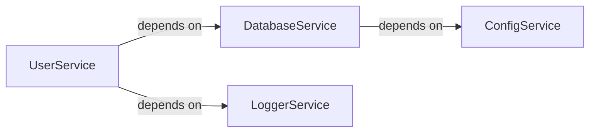
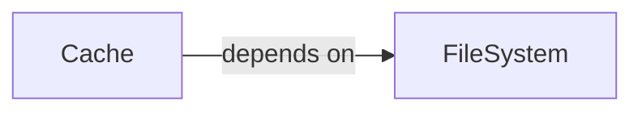
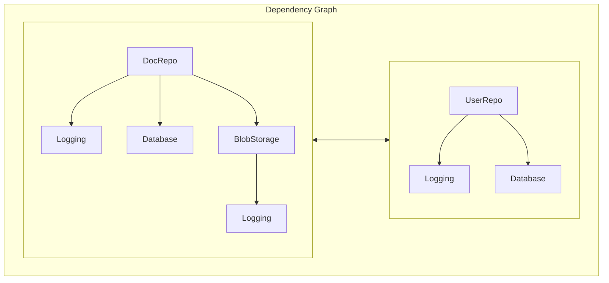
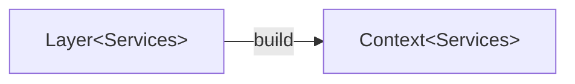
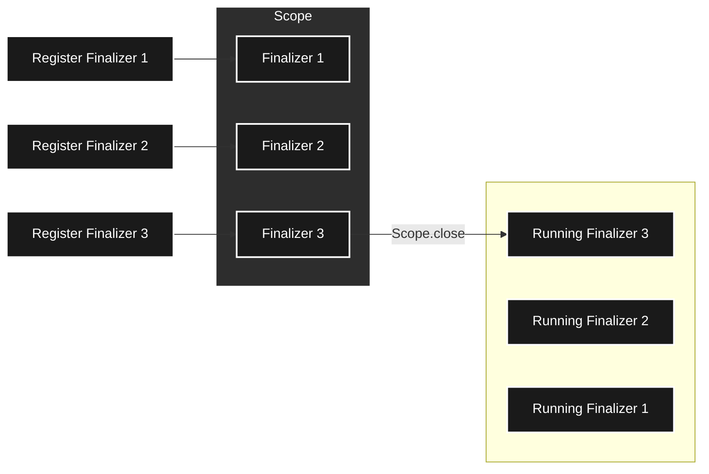
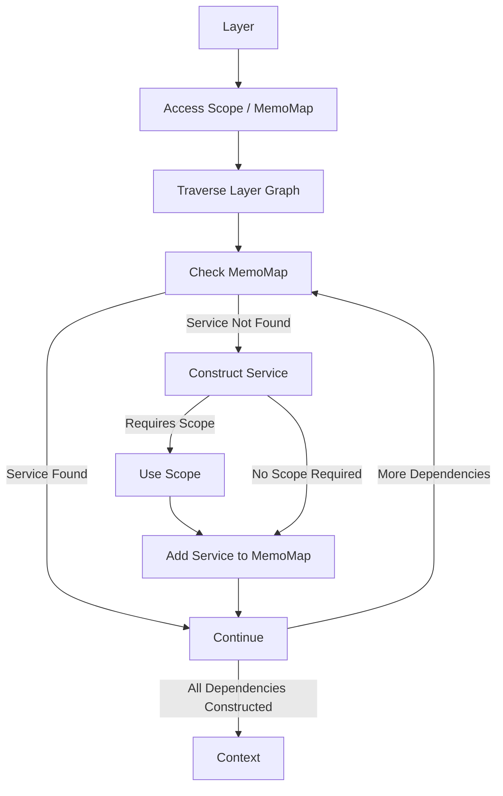

<h2>
Wifi: SALA CONVEGNI<br />
Password: SalaConvegni<br /><br />

Git repository:
</h2>

`https://github.com/Effect-TS/effect-days-2025-workshop.git`

---

# Effect Days 2025

<div class="text-2xl">
  Welcome to the Workshop!
</div>

---

# Workshop Schedule

<div class="text-sm [&_th]:font-bold [&_td]:pr-8 [&_td]:py-2">

| Speaker |           | Time Slot           | Duration   |
| :------ | :-------- | :------------------ | :--------- |
| Max     | Session 1 | 9:00 AM – 10:30 AM  | 1.5 hours  |
|         | Break     | 10:30 AM – 10:45 AM | 15 minutes |
|         | Session 2 | 10:45 AM – 12:15 PM | 1.5 hours  |
|         | Lunch     | 12:15 PM – 1:15 PM  | 1 hour     |
| Tim     | Session 3 | 1:15 PM – 2:45 PM   | 1.5 hours  |
|         | Break     | 2:45 PM – 3:00 PM   | 15 minutes |
|         | Session 4 | 3:00 PM – 4:30 PM   | 1.5 hours  |
|         | Q & A     | 4:30 PM – 5:00 PM   | 30 minutes |

</div>

<!--
- Session 1 & 2
  - Focus on learning the basics of how to use services in Effect to build
    robust and maintainable systems
  - Cover from the basics up to more advanced concepts
- Session 3 & 4
  - Tim will focus on how to use what we learned in section one to allow you to
    incrementally adopt Effect into your existing applications
  - Will contain more advanced patterns
-->

---

### Section One

# Service-Oriented Application Design with Effect

---

# Learning Objectives

<v-clicks>

- Understand the concept of a "service" in Effect
- Gain experience with building and composing services 
- Explore the motivation behind the `Layer` type 
- Learn best practices for structuring an application 

</v-clicks>

---

# Introduction to Services

---

# Purpose of a Service 

<v-after hide>

> Code to an interface, not an implementation

</v-after>

<v-clicks>

- Abstracts Functionality
- Useful for Prototyping
- Facilitates Easier Testing
- Composition & Modularity 

</v-clicks>

<!--
- Allow you to separate the usage of particular functionality from its actual implementation
- Programming to an interface means you can worry about the actual implementation later
- Implementations of a particular service are interchangeable
  - Facilitates swapping out different implementations both for testing and at runtime
- Services in Effect are easily composable and create a clear dependency graph
  - Allows for composition of business logic
  - Refactoring becomes much easier
-->

---

# Service Terminology

| Term      | Definition                                                  |
|:----------|:------------------------------------------------------------|
| `Service` | An interface that exposes a particular set of functionality |
| `Tag`     | A unique type-level & runtime identifier for a service      |
| `Context` | A container which holds a map of `Tag -> Service`           |

<!--
- A `Service` is just an interface that describes a set of operations we can perform
  - Examples: 
    - Set of configuration values
    - Set of operations describing interactions with an external system
  - Meant to encapsulate business logic
- A `Tag` gives us a way to conceptually "bind" the interface of our service to an actual implementation
  - Acts as a unique identifier for a service both on the type-level and at runtime 
- A `Context` serves as the container for all services that an Effect program might require
  - The service's `Tag` is used to index into a `Context` and returns the implementation of the service
-->

---

# Defining a Service

````md magic-move

<<< @/src/examples/section-1/001_defining-a-service-01.ts ts

<<< @/src/examples/section-1/001_defining-a-service-02.ts ts

````

<!--
### Context.GenericTag

- In practice, the lowest level strategy for creating services uses `Context.GenericTag`
- Problems with this approach
  - Having to ensure the type-level identifier is unique
  - Verbose, but for good reason
    - `unique symbol` ensures that services have a distinct identity across all 
      codebases
      - Don't want to mistake one service for another
    - `"app/Cache"` is used as a literal identifier and discriminator 
      - Must be unique both at type-level and runtime otherwise services will clash
- Not recommended in the vast majority of circumstances
  - Only usage that comes to mind at the moment is dynamically creating tags for
    generic services

### Context.Tag

- We can do the same in a much more concise and robust manner via `Context.Tag`
- Recommended approach when you cannot use `Effect.Service` (discussed later)

### Data.TaggedError 
- Also worth pointing out that we're creating a custom error using `Data.TaggedError`
- `Data.TaggedError` is a utility that allows us to create custom errors with 
  a `_tag` property that can be used as a discriminator
- The `_tag` property is commonly utilized in Effect to discriminate between
  different types, and also has some specialized methods (i.e. `catchTag`)
-->

---

# Exercise: Creating a Service

`src/exercises/section-1/001_creating-a-service.ts`

---

# The Pun-ishment Protocol

<v-switch>

<template #1>

> A behavioral management system that weaponizes puns as a disciplinary tool

Matches severity of child misbehavior with a proportionally painful pun
- Simple pun for minor offenses
- Elaborate, multi-punchline groaners for serious infractions

</template>

<template #2>

Key components include:

- **Pun Distribution Network (PDN)**
- **Immunity Token Manager**
- **PUNSTER**
  > <ins>P</ins>un <ins>U</ins>tility for <ins>N</ins>eurological <ins>S</ins>entiment <ins>T</ins>esting & <ins>E</ins>motional <ins>R</ins>esponse

</template>

<template #3>

<div class="mt-8">



</div>

</template>

</v-switch>

<!--
# Key Components
- **Pun Distribution Network (PDN)**: Manages limited communication channels (dinner, car rides, bedtime) for optimal pun delivery
- **PUNSTER**: Fetches puns based on specific misbehavior categories and evaluate the result of pun delivery
- **Immunity Token Manager**: Allows children to earn pun immunity tokens through good behavior
-->

---

# Exercise: Creating a Service

`src/exercises/section-1/001_creating-a-service.ts`

Create the service definitions for the following: 

- `PunDistributionNetwork`
- `PunsterClient`
- `ImmunityTokenManager`

<!--
- The goal of this exercise is to get experience defining services in Effect
-->

---

# Exercise Recap: Creating a Service

`src/exercises/section-1/001_creating-a-service-solution.ts`

<v-clicks>

- We imported the `Context` module from `"effect"`
- We used `Context.Tag` to create unique service identifiers 

</v-clicks>

---

# Using a Service

```ts {lines:false}
ServiceTag.pipe(
  Effect.andThen((serviceImpl) => ...)
)

// or 

Effect.gen(function*() {
  const serviceImpl = yield* ServiceTag
  ...
})
```

<!--
- Accessing a service within the context of an Effect is easy
  - `pipe`-ing the service `Tag` into another Effect method (i.e. `Effect.andThen`)
  - `yield*`-ing the service `Tag` in an `Effect.gen`
- This can be done before we've ever written a single line of implementation code
- And it's type safe - the program won't compile if you try to `Effect.runPromise`
-->

---

# Using a Service

<<< @/src/examples/section-1/002_using-a-service.ts ts {|7-9|14-15|16-18|11-13}

<!--
- Access the service in the Context of the effect
- Use service methods
- Once again notice that we haven't actually defined an implementation for 
  our service yet
  - Effect tracks that we will _eventually_ need to provide a `Cache` for 
    our program to run
-->

---

# Exercise: Using a Service

`src/exercises/section-1/002_using-a-service.ts`

Define the `main` Effect:
  - Access the requisite services in the program
  - Use the service interfaces to implement the business logic

---

# Exercise Recap: Using a Service

`src/exercises/section-1/002_using-a-service-solution.ts`

<v-clicks>

- We accessed services via their `Tag`s
- We used the service interfaces to implement our business logic
- We observed that we have not _implemented_ our services yet
- We observed that services are tracked in the `Requirements` type

</v-clicks>

---

# Providing a Service

```ts {lines:false}
effect.pipe(
  // Associate a concrete implementation with its Tag
  Effect.provideService(ServiceTag, serviceImpl)
)

// or

effect.pipe(
  // Associate an Effect that produces a concrete implementation
  // with its Tag
  Effect.provideServiceEffect(ServiceTag, Effect<serviceImpl, ...>)
)
```

<!--
- Several methods exist to actually provide an implementation of our service 
  to our program
- Two of the most basic:
  - `Effect.provideService`: provide a concrete implementation of our service
    to the program
  - `Effect.provideServiceEffect`: allows us to provide an `Effect` which will
    result in an implementation of our service
-->

---
layout: default
---

# Providing a Service

<<< @/src/examples/section-1/003_providing-a-service.ts ts {1-17|19-}{maxHeight:'400px'}

<style>
/* Hide the scrollbar */
.slidev-code-wrapper {
  -ms-overflow-style: none;
  scrollbar-width: none;
}
.slidev-code-wrapper::-webkit-scrollbar { 
  display: none;  /* Safari and Chrome */
}

/* Remove margin from code block */
.slidev-code.shiki {
  margin: 0;
}
</style>

<!--
- We still have the implementation of `program` here which is completely agnostic
  of the implementation of `Cache`
  - We're accessing the `Cache` using our `Tag`
  - Calling `getUser` to fetch the user with id `"123"`
  - Logging out the result
- Worth calling out that we're using the auto-generated static `of` property
  on `Tag`, which is basically an identity function that gives you the type
  of the service shape
  - Otherwise, you'd have to manually type everything in the service definition (i.e. `key: string`, etc.)
- To make the program runnable, we need to provide an implementation of `Cache`
  - Here, we are using `Effect.provideService` to provide an implementation
  - Not very flexible because we can't access any other services
  - If we need access to other services we could use `Effect.provideServiceEffect`
  - We'll see in a bit why that approach doesn't really scale well
-->

---
class: text-center
---

# Demo: Providing a Service 

### Single Implementation

<div class="my-4">

`src/demos/section-1/001_providing-a-service-00.ts`

</div>

<!--
- In this demo, we'll show how you can provide a single implementation of a
  service to an Effect program
-->

---
class: text-center
---

# Demo: Providing a Service 

### Multiple Implementations

<div class="my-4">

`src/demos/section-1/001_providing-a-service-01.ts`

</div>

<!--
- In this demo, we'll show how you can provide multiple implementations of a
  service to different parts of an Effect program
-->

---

# Exercise: Providing a Service

`src/exercises/section-1/003_providing-a-service.ts`

Create a test implementation of the `PunsterClient`:
  - Should always return the same `Pun` from `createPun`
  - Should always return the same evaluation from `evaluatePun`
  - Provide the test implementation to the `main` program

---

# Exercise Recap: Providing a Service

`src/exercises/section-1/003_providing-a-service-solution.ts`

<v-clicks>

- We created a test implementation of our `PunsterClient` 
- We provided the implementation to `main`
- We observed that swapping implementations is trivial

</v-clicks>

---

# FileSystemCache

This is not testable!

```ts {|2,9}
import { Context, Data, Effect } from "effect"
import * as fs from "node:fs/promises"

// ... <snip> ...

const FileSystemCache = Cache.of({
  lookup: (key) =>
    Effect.tryPromise({
      try: () => fs.readFile(`src/demos/section-1/cache/${key}`, "utf-8"),
      catch: () => 
        new CacheMissError({ 
          message: `Failed to read file for cache key: "${key}"` 
        })
    })
})
```

<!--
- There is a problem with the implementation of our `FileSystemCache` service
  in the previous demonstration
  - It is hard-coded to utilize the NodeJS file system module
  - Not easy to test without jumping through hoops with mocking
  - May not work well on JavaScript runtimes that are not compatible with NodeJS
- How do we go about solving this problem?
  - Abstract the file system requirement into it's own service!
  - Easy to swap out implementations during testing and for other runtimes
-->

---

# Services with Dependencies 

- Services can have dependencies on other services
- Naturally results in a directed acyclic graph of services

<div class="mt-8">



</div>

<!--
- As we continue to break down programs into services, we will naturally 
  build up a directed acyclic graph of services and their dependencies
- For example, in this diagram:
  - We have a `UserService` which depends on a `DatabaseService` and a `LoggerService`
  - Our `DatabaseService`  depends on some configuration provided by the `ConfigService`
- When we provide these services to our program, the build order must respect the 
  dependency relationship
  - `ConfigService` must be constructed first so that it can be consumed by the 
    `DatabaseService`
  - The `DatabaseService` and `LoggerService` must be constructed next so that 
    they can be consumed by the `UserService`
  - Finally, the `UserService` can be constructed
-->

---

# Services with Dependencies

<div class="mt-8">


</div>

<!--
- Our Pun-ishment Protocol application also has services which depend on other services
-->

---
class: text-center
---

# Fixing the FileSystemCache

<div class="spacing-y-4">


A cache that depends on a file system

</div>

<!--
- Let's take a look at how we can fix the issue in our `FileSystem` cache by
  introducing a `FileSystem` service
-->

---

# Avoid Leaking Requirements 

````md magic-move

<<< @/src/examples/section-1/004_avoid-leaking-requirements-01.ts ts {|4-10|}

<<< @/src/examples/section-1/004_avoid-leaking-requirements-02.ts ts {|17-18}

<<< @/src/examples/section-1/004_avoid-leaking-requirements-03.ts ts {17-18}

````

<!--
- Here we've separated the requirement of a file system out into a separate
  service
- But theres still a problem - can anyone spot it?
- The `Cache` service should not expose the dependency on `FileSystem` in its
  external interface
  - Reduces flexibility / modularity
  - Different implementations might not need a file system 
- In the vast majority of circumstances you will want your services to have no
  requirements in their external interface
- Accessing service requirements should be handled at the constructor level
-->

---

# Providing Dependent Services

<<< @/src/examples/section-1/005_providing-dependent-services.ts ts {1-18|20-29|31-47|49-56|58-}{maxHeight:'400px'}

<style>
/* Hide the scrollbar */
.slidev-code-wrapper {
  -ms-overflow-style: none;
  scrollbar-width: none;
}
.slidev-code-wrapper::-webkit-scrollbar { 
  display: none;  /* Safari and Chrome */
}

/* Remove margin from code block */
.slidev-code.shiki {
  margin: 0;
}
</style>

<!--
# Services With Dependencies 
- Start with service definitions of `Cache` and `FileSystem` from before
### Goals
  - Write the same program that accesses a `Cache` and uses `lookup`
  - Provide a `Cache` implementation that uses a file system behind the scenes
### Steps
  1. Create an effectful constructor for a `Cache` that uses a `FileSystem`
     - Access the `FileSystem` service
     - Use `fs.readFileString` to read the file for the provided cache key
     - Map any errors that come back to satisfy the `Cache` interface
     - **Result**: an Effect that produces a `Cache` and requires a `FileSystem`
  2. Provide the `Cache` implementation to our program
     - `Cache` dependency is erased from `program`
     - New dependency on `FileSystem` is introduced by the cache constructor
  3. Provide a `FileSystem` dependency
     - Eliminates all remaining dependencies and makes the Effect runnable
-->

---

# Going Further

As the number of services grow, thair relational complexity grows 

<v-click>

How do we deal with...

- Service composition?
- Singleton services?
- Resource safety?

</v-click>

<!--
### Problems
- As an application grows, the number of services it has will grow
- As the number of services grow, it can get very difficult to reason about 
  the relationships between services
- How do we deal with problems like:
  - Service composition?
  - Service memoization to achieve singletons?
  - Resource acquisition and safety?
-->

---

# Complex Service Relationships

<div class="mt-8">



</div>

<!--
- Example of an application with complex service relationships
- Dependency Graph
  - Two "top-level" subgraphs (`DocRepo` and `UserRepo`)
  - Dependencies are shared between the subgraphs
- It is _possible_ to build this graph manually, but it is non-trivial
- Application level services are generally singletons
- What if some services are resourceful? (`Database` might need connections)
- What if some services contain long-running background fibers?
-->

---

# Introduction to Layers

---

# Issues with Services

<v-clicks>

- A service may have one or more dependencies
- A service must have dependencies provided in the correct order
- A service might be **resourceful**

</v-clicks>

<!--
- Services with multiple dependencies must have them provided in the right order
- Gets really complex as the service graph grows
  - How to ensure services are only built once?
  - How to ensure resourceful services are safe?
-->

---

# Layer as Service Constructor

A data type which represents a constructor for one or more services

<v-clicks>

- May depend on other services 
- May fail to construct a service, producing some error value
- May manage the acquisition / release of resources 
- Easily composable with other `Layer`s
- Are memoized during resolution of the dependency graph

</v-clicks>

<!--
### Features of Layers
- A layer is a data type that describes how to construct one or more services
- Describes the dependencies that a service constructor requires
- Describes possible failure scenarios that may occur when constructing a service
- Has the ability to safely manage the acquisition and release of resources 
- Is easily composable with other layers
- Are memoized by default after being evaluated 
  - Layers can be used in multiple places in the dependency graph
  - Only built once
  - Memoized **BY REFERENCE**
-->

---

# The `Layer` Type

```text {lines:false}
        ┌─── The service(s) to be created
        │                ┌─── The possible error
        │                │      ┌─── The required dependencies
        ▼                ▼      ▼
Layer<RequirementsOut, Error, RequirementsIn>
```

<div v-click class="">

Technically...



</div>

<!--
- The `Layer` type in Effect is a powerful abstraction in Effect which allows 
  for representing service contructors as a value
- Similar to the `Effect` type, the `Layer` type has three type parameters:
  - `RequirementsOut` represents the service or services that the `Layer` produces
     when evaluated
  - `Error` represents the error that may occur as a result of constructing the 
     services
  - `RequirementsIn` represents the service or services that the `Layer` requires 
     to be evaluated
- Technically speaking, building a `Layer` _actually_ produces a `Context`
-->

---

# Creating a Layer

```ts {|1-6|8-13|15-20|23-}{maxHeight:'400px'}
// Static layers
Layer.succeed(
  ServiceTag,
  // Define a concrete service implementation
  ServiceShape
) // -> Layer<ServiceTag, never, never>

// Synchronous layers
Layer.sync(
  ServiceTag,
  // A thunk that produces the concrete service implementation
  () => ServiceShape
) // -> Layer<ServiceTag, never, never>

// Asynchronous layers
Layer.effect(
  ServiceTag,
  // An Effect that produces the concrete service implementation
  Effect<ServiceShape, ...>
) // -> Layer<ServiceTag, never, never>

// Resourceful layers
Layer.scoped(
  ServiceTag,
  // A scoped Effect that resourcefully produces the concrete 
  // service implementation 
  Effect<ServiceShape, ..., Scope>
) // -> Layer<ServiceTag, never, Scope>
```

<style>
/* Hide the scrollbar */
.slidev-code-wrapper {
  -ms-overflow-style: none;
  scrollbar-width: none;
}
.slidev-code-wrapper::-webkit-scrollbar { 
  display: none;  /* Safari and Chrome */
}

/* Remove margin from code block */
.slidev-code.shiki {
  margin: 0;
}
</style>

<!--
- Looks similar to providing services via `Effect.provideService` & co. 
- As I mentioned in the previous slide:
  - `Layer` produces a `Context` containing the built services
  - Hence the need for the service `Tag`
-->

---

# Creating a Layer (Example)

<<< @/src/examples/section-1/006_creating-a-layer.ts ts {1-18|20-26|28-44|46-51|53-61|63-68|70-74}{maxHeight:'400px'}

<style>
/* Hide the scrollbar */
.slidev-code-wrapper {
  -ms-overflow-style: none;
  scrollbar-width: none;
}
.slidev-code-wrapper::-webkit-scrollbar { 
  display: none;  /* Safari and Chrome */
}

/* Remove margin from code block */
.slidev-code.shiki {
  margin: 0;
}
</style>

<!--
- Still have our service definitions from earlier
- Still have the program from earlier
- Extracted the constructor for the `Cache`
- Use the `Layer.effect` constructor to create a `Layer` from an Effect that 
  produces a `Cache` and requires a `FileSystem` 
- Use the `Layer.succeed` constructor to create a `Layer` from a static service
  definition
- Use `Layer.provide` to provide the `FileSystem` layer to the `Cache` layer
-->

---

# Exercise: Creating a Layer

`src/exercises/section-1/004_creating-a-layer.ts`

Define `Layer`s for each of our services:
  - `PunDistributionNetworkLayer`
  - `PunsterClientLayer`
  - `ImmunityTokenManagerLayer`

---

# Exercise Recap: Creating a Layer

`src/exercises/section-1/004_creating-a-layer-solution.ts`

<v-clicks>

- We imported `Layer` from the `"effect"` module
- We used `Layer.effect` for non-resourceful services
- We used `Layer` combinators to compose `Layer`s together
- We have a lingering `Scope` in our requirements

</v-clicks>

---

# Simplifying Service Definitions

```ts {|5-18|5|6-16|17-18|21-26|28-}{maxHeight:'400px'}
import { Effect } from "effect"

// ...<snip>...

class Cache extends Effect.Service<Cache>()("app/Cache", {
  effect: Effect.gen(function*() {
    const fs = yield* FileSystem
    function lookup(key: string): Effect.Effect<string, CacheMissError> {
      return fs.readFileString(`./src/demos/section-1/cache/${key}`).pipe(
        Effect.mapError(() => {
          return new CacheMissError({ message: `failed to read file for cache key: "${key}"` })
        })
      )
    }
    return { lookup } as const
  }),
  // Provide service dependencies (optional) 
  dependencies: [FileSystemLayer]
}) {}

// This layer is automatically generated by `Effect.Service` and 
// will build the `Cache` service
//
//       ┌─── Layer<Cache, never, never>
//       ▼
Cache.Default

// This layer is automatically generated by `Effect.Service` and 
// will build the `Cache` service without any dependencies provided
// (only generated if you specify `dependencies`)
//
//              ┌─── Layer<Cache, never, FileSystem>
//              ▼
Cache.DefaultWithoutDependencies
```

<style>
/* Hide the scrollbar */
.slidev-code-wrapper {
  -ms-overflow-style: none;
  scrollbar-width: none;
}
.slidev-code-wrapper::-webkit-scrollbar { 
  display: none;  /* Safari and Chrome */
}

/* Remove margin from code block */
.slidev-code.shiki {
  margin: 0;
}
</style>

<!--
- Most of the methods we've seen thus far are somewhat verbose 
  - Need to declare the service Tag
  - Need to write the service constructor 
  - Need to package that up into a Layer
- `Effect.Service` simplifies the declaration of a service
  - The class becomes our `Tag`
  - The constructor is specified in the class declaration
  - Dependencies can be specified inline
- The class comes with default `Layer`(s) 
  - `Default`
    - Always generated
    - Includes service requirements in the `Layer` if `dependencies` not specified
  - `DefaultWithoutDependencies` 
    - Only generated if you specify `dependencies`
    - Includes service requirements in the `Layer`
-->

---

# Simplifying Service Definitions (Example)

<<< @/src/examples/section-1/007_simplifying-service-definitions.ts ts {1-16|18-20|22-39|41-43|45-51|53-}{maxHeight:'400px'}

<style>
/* Hide the scrollbar */
.slidev-code-wrapper {
  -ms-overflow-style: none;
  scrollbar-width: none;
}
.slidev-code-wrapper::-webkit-scrollbar { 
  display: none;  /* Safari and Chrome */
}

/* Remove margin from code block */
.slidev-code.shiki {
  margin: 0;
}
</style>

<!--
- Redefined our `FileSystem` service with `Effect.Service`
- Our `Cache` now depends on the `FileSystem.Default` layer
- We still have our original program from earlier which utilizes the `Cache`
- Now we can provide the `Cache.Default` layer to our program with `Effect.provide`
  to satisfy all dependencies
-->

---

# Exercise: Simplifying Service Definitions

`src/exercises/section-1/005_simplifying-service-definitions.ts`

Re-define our services using `Effect.Service`:
  - `PunDistributionNetwork`
  - `PunsterClient`
  - `ImmunityTokenManager`

---

# Exercise Recap: Simplifying Service Definitions

`src/exercises/section-1/005_simplifying-service-definitions-solution.ts`

<v-clicks>

- We used `Effect.Service` to define both a `Tag` and `Layer` 
- We used the `dependencies` to locally provide dependencies
- We still have that lingering scope in the requirements

</v-clicks>

---

# Resourceful Layers

<!--
- Very useful when you want the lifetime of a resource to be the same as the
  lifetime of your application
- But what do I mean by "lifetime" and "resource"?  
  - To answer that let's take a quick detour from `Layer` and chat about `Scope`
-->

---

# A Quick Aside on Scope



<!--
- Before we can discuss resourceful `Layer`s, we need to understand the concept of a `Scope` 
- A `Scope` is the foundation of safe and composable resource management in Effect
- Represents the lifetime of one or more resources
- Resources can be safely acquired and used within a `Scope`
- Resources are guaranteed to be released when the `Scope` is closed
-->

---

# Scoped Effects (Example)

<<< @/src/examples/section-1/008_closing-a-scope.ts ts {|3-13|15-26|27-}{maxHeight:'400px'}

<style>
/* Hide the scrollbar */
.slidev-code-wrapper {
  -ms-overflow-style: none;
  scrollbar-width: none;
}
.slidev-code-wrapper::-webkit-scrollbar { 
  display: none;  /* Safari and Chrome */
}

/* Remove margin from code block */
.slidev-code.shiki {
  margin: 0;
}
</style>

<!--
- When we perform resourceful operations in Effect:
  - A `Scope` is added to the dependencies of our program
- At some point a `Scope` must be provided to run the program
- The lifetime of resources managed by a `Scope` will depend upon where the
  `Scope` is closed
- `Effect.scoped` is a common method of providing a `Scope` to a program
- A `Scope` can also be managed manually, which can be extremely useful
  for more complex scope management scenarios (e.g. `Layer` building)
-->

--- 

# Using a `Scope`

<<< @/src/examples/section-1/009_effect-scoped.ts ts {|4-5|7-23|10-13|14-22|25|27|29}{maxHeight:'400px'}

<style>
/* Hide the scrollbar */
.slidev-code-wrapper {
  -ms-overflow-style: none;
  scrollbar-width: none;
}
.slidev-code-wrapper::-webkit-scrollbar { 
  display: none;  /* Safari and Chrome */
}

/* Remove margin from code block */
.slidev-code.shiki {
  margin: 0;
}
</style>

<!--
# Code Walkthrough

1. Manually create a `Scope`
2. Define a resourceful program
   - Acquires a resource (in this case just a `string`)
   - Defines a finalizer for the resource
     - Note that the finalizer has access to:
       - The resource that was acquired
       - The `Exit` value provided when the `Scope` is closed
3. Extend the `Scope` to our program
   - i.e. "Take all the finalizers in this program and attach 
     them to this Scope"
4. Run the program and obtain the `Exit` value
5. Close the `Scope`, providing the `Exit` value so the 
   finalizers have this information to work with

# Key Takeaways

- Understanding basic `Scope` operations
- If a `Scope` is never closed, its resources are never released
-->

---



<!--
# How Layers are Constructed

1. A `Scope` is created along with a type called a `MemoMap`
   - A data type that's used to memoize the results of layers that have been constructed
   - Prevents re-building services when the same `Layer` is provided in multiple 
     places within the dependency graph
2. Traverse the layer graph to build all the requisite services
3. If found in `MemoMap`, nothing to do
4. If not found, build the service
   - Provide the `Scope` if the `Layer` is a scoped layer
5. Add service to `MemoMap` and continue until done
6. The result is a `Context` object containing all our built services

This is specifically why we advocate against multiple `Effect.provide` calls in
your application.
-->

---

# Providing a Layer (Example)

<<< @/src/examples/section-1/010_providing-a-layer.ts ts {|3-7|9-13|16-23|25-30|32-37|39-44|46-51|53-54|56-57}{maxHeight:'400px'}

<style>
/* Hide the scrollbar */
.slidev-code-wrapper {
  -ms-overflow-style: none;
  scrollbar-width: none;
}
.slidev-code-wrapper::-webkit-scrollbar { 
  display: none;  /* Safari and Chrome */
}

/* Remove margin from code block */
.slidev-code.shiki {
  margin: 0;
}
</style>

<!--
In this example, we're going to simulate what happens behind the scenes when 
you `Effect.provide` a `Layer`.

# Code Walkthrough
1. Setup service definition
2. Setup layer definition for service
3. Create a program which uses the service
4. Manually create a `Scope`
5. Use `Layer.build` to create a scoped `Effect` that, when executed, will 
   result in a `Context` object containing all services contructed by the `Layer`
6. Run the builder with the `Scope` we created 
7. Provide the `Context` to the program 
8. Run the program and obtain its `Exit`
9. Close the scope to release `Layer` resources
-->

---

# Resourceful Layers (Example)

<<< @/src/examples/section-1/011_resourceful-layers.ts ts {|9-26|11-16|17-20|33-50|37,40,47|34|52-60|62-65|63}{maxHeight:'400px'}

<style>
/* Hide the scrollbar */
.slidev-code-wrapper {
  -ms-overflow-style: none;
  scrollbar-width: none;
}
.slidev-code-wrapper::-webkit-scrollbar { 
  display: none;  /* Safari and Chrome */
}

/* Remove margin from code block */
.slidev-code.shiki {
  margin: 0;
}
</style>

<!--
- Let's say we want to refactor our `Cache` service to utilize a temporary
  directory on the file system
  - The temporary directory should be created when the program starts
  - The temporary directory should be removed when the program ends
- First we add a method onto our `FileSystem` to allow for creating temp directories
  - Utilizes `Effect.acquireRelease`:
    - The acquire effect creates the temp directory
    - The release effect will remove the directory when the scope closes
  - Also utilizes `Effect.promise` instead of `Effect.tryPromise`
    - We want errors in this case to be defects
- Then we utilize this in the constructor of our `Cache` service 
  - Will create the temporary directory when the service is constructed
  - Also expose the temp directory from the cache so we can use it in our program
  - Adds a requirement on a `Scope` to our `Cache` service constructor
- We then utilize `scoped` layer constructor 
  - This ensures the temporary directory will not be cleaned up until our
    layer scope is closed, which in this case is when our application exits
- We've re-written our program a little to:
  - Access the `FileSystem`
  - Use the `FileSystem` to write a key / value pair into our cache directory
  - Notice that this has added the `FileSystem` to the program's dependencies
- Finally we run our program, providing all dependencies
  - `Effect.provide` has several overloads, one of which allows you to pass an 
    array of layers (equivalent to doing a `Layer.mergeAll`)
- Astute observers may notice we're technically providing `FileSystem` twice
  - Once in the dependencies of `Cache`
  - Once in the call to `Effect.provide`
-->

---

# Exercise: Resourceful Layers

`src/exercises/section-1/006_resourceful-layers.ts`

Remove the `Scope` requirement from our final `Layer`:
  - Resourceful services should cleanup when the program ends

---

# Exercise Recap: Resourceful Layers

`src/exercises/section-1/006_resourceful-layers-solution.ts`

<v-clicks>

- We used `Layer.scoped` to control the liftime of resources acquired during 
  service construction
- We locally eliminated requirements for each of our services
- We created a `MainLayer` which combines all of our services
- We provided a `NodeHttpClient` to the `MainLayer` to satisfy all requirements

</v-clicks>

---

# Layer Composition 

There are two primary methods for `Layer` composition: 

<v-clicks>

- **Merging** - merges the inputs and outputs of two layers together
- **Providing** - provides the outputs of one layer as inputs to another

</v-clicks>

<!--
- May not need these operators if you rely primarily on `Effect.Service`
-->

---

# Merging Layers

<<< @/src/examples/section-1/012_merging-layers.ts ts

<!--
- Merging layers merges the inputs, outputs, and errors of both layers together
-->

---

# Providing Layers

<<< @/src/examples/section-1/013_providing-layers.ts ts

<!--
- Providing one layer to another allows the outputs of the provided layer 
  to satisfy requirements of another layer
-->

---

# Providing & Merging Layers

<<< @/src/examples/section-1/014_providing-and-merging-layers.ts ts

<!--
- We can also provide and merge layers together at the same time, effectively
  passing the outputs of the provided layer through while still allowing them
  to satisfy the other layer's requirements
-->

---

# Exercise: Layer Composition

`src/exercises/section-1/007_layer-composition.ts`

Remove the `Scope` dependency from our final `Layer`:
  - Resourceful services should cleanup when the program ends

---

# Exercise Recap: Layer Composition

`src/exercises/section-1/007_layer-composition-solution.ts`

<v-clicks>

- We practiced `Layer` composition using the following methods:
  - `Layer.provide`
  - `Layer.merge`
  - `Layer.provideMerge`
- We observed why local elimination of requirements is recommended 

</v-clicks>

---

# Designing around Layers

- Identify key subsystems within an application
- Decompose these subsystems into services
- Build up a set of top-level layers to provide

<!--
- In Effect applications, we've found the more that you design around layers
  and services, the easier it is to maintain and test your software
- Even the main function of your app can be a `Layer`
  - `Layer.launch` for long-running processes (i.e. servers)
- We will see more of how you can orient your app around layers in the next 
  session with Tim!
-->

---

# Layers - Best Practices

- Use `Effect.Service` wherever possible
- Locally provide service dependencies (if possible)
- Avoid multiple calls to `Effect.provide`
- Remember that `Layer`s are memoized by _reference_

<!--
- Local vs. non-local elimination of dependencies
  - Prefer to do this when possible
  - May not be possible in some circumstances
- Multiple calls to `Effect.provide` should generally be avoided
  - Resource intensive and prevents sharing of layers
  - Prefer to use `Effect.provideService{Effect}` if you need to locally 
    provide services 
  - O.K. if your passing a `Context` or a `Runtime`
- Take care to avoid issues with memoization
  - If you are using layers created by calling a function, only call the function _once_
-->

---

# Exercise: Running the Pun-ishment Protocol

`src/exercises/section-1/008_running-the-application.ts`

Run the Pun-ishment Protocol application!
  - You can use the following command to run the file 

`pnpm exercise ./src/exercises/section-1/008_running-the-application.ts`


---

# Exercise Recap: Running the Pun-ishment Protocol

`src/exercises/section-1/008_running-the-application.ts`

<v-clicks>

- We combined our `Layer`s into a `MainLayer`
- We used `Effect.provide` to provide our `Layer` to the `main` program
- We ran our program and observed the output

</v-clicks>

---

### Section Two

# Incremental Adoption of Effect

---

# Learning objectives

<v-clicks>

- Learn how to integrate Effect into an existing codebase
- Understand strategies for wrapping existing business logic into Effect layers
- Gain experience in incrementally adopting Effect
- Explore interoperability with non-Effect code

</v-clicks>

---

# So, you want to adopt Effect?

<v-clicks depth="2">

- But you are already using other frameworks
- You are using libraries with Promise-based APIs
- Existing code isn't written holistically
  - Error handling
  - Resource management
  - Interruption
  - Observability

</v-clicks>

<!--
- React, express, Next.js, Nest.js, etc.

- ORM's, HTTP clients, API clients
-->

---

# Holistic thinking

<v-click>
When adopting Effect, you start thinking about things that you might have
overlooked before.
</v-click>

<v-clicks>

- What kind of errors can occur?
- Are resources being alloacted here? And how should I release them?
- How do I abort expensive computations?
- How do I monitor the execution of this code?

</v-clicks>

---

# Wrapping Promise-based libraries

---

# The `use` pattern

<v-clicks>

A common approach to wrapping Promise-based libraries with Effect is to create
an Effect.Service that exposes an `use` method.

```ts
interface SomeApi {}

declare const use: <A>(f: (api: SomeApi) => Promise<A>) => Effect<A>
```

</v-clicks>

---

# Demo: Wrapping OpenAI

`src/demos/section-2/openai-00.ts`

---

# OpenAI demo recap

<v-clicks>

- We used Effect.Service with the `use` pattern to wrap the OpenAI library
- We used the `Config` module to retrieve the client configuration
- We used `Schema.TaggedError` to wrap errors (you could also use
  `Data.TaggedError`)
- We considered interruption by passing an `AbortSignal`
- We used `Effect.fn` to add tracing to our `use` method
- There was no "resources" that needed to be managed

</v-clicks>

---

# Questions?

---

# Exercise: Wrap a sqlite client

`src/exercises/section-2/sqlite-01.ts`

---

# Wrapping paginated APIs

A lot of APIs return paginated data. How do we wrap them with Effect?

<v-clicks depth="2">

- Streams!
  - `import { Stream } from "effect"`
- Stream.paginate\*

</v-clicks>

---

# Stream.paginateChunkEffect

Allows you to continuously fetch data using some kind of cursor.

```ts {all|2|3|all}
export const paginateChunkEffect: <S, A, E, R>(
  s: S,
  f: (s: S) => Effect.Effect<readonly [Chunk.Chunk<A>, Option.Option<S>], E, R>,
) => Stream<A, E, R>
```

<v-click>

```ts
import { Chunk, Effect, Option, Stream } from "effect"

Stream.paginateChunkEffect(1, (page) =>
  fetchPage(page).pipe(
    Effect.map((items) => [Chunk.unsafeFromArray(items), Option.some(page + 1)]),
  ),
)
```

</v-click>

---

# Demo: OpenAI pagination

`src/demos/section-2/openai-paginate-00.ts`

---

# OpenAI pagination recap

<v-clicks>

- We used `Stream.paginateChunkEffect` to continuously fetch data
- We tracked the cursor using OpenAI's Page api
- We used `Effect.fn` & `Stream.withSpan` to add tracing to our stream

</v-clicks>

---

# Questions?

---

# Wrapping specialized APIs

<v-clicks>

- Some libraries have more specific APIs, like streaming completions from OpenAI
- This may require adding additional service methods to make usage more ergonomic

</v-clicks>

---

# Demo: OpenAI streaming completions

`src/demos/section-2/openai-completions-00.ts`

---

# OpenAI completions example recap

<v-clicks>

- For commonly used APIs, it may be beneficial to create seperate service
  methods to improve ergonomics
- There is often Effect API's you can use to wrap common JavaScript data types.
  I.e. we used `Stream.fromAsyncIterable` to wrap the OpenAI stream.
- Creating ergonomic APIs can require some reverse engineering effort

</v-clicks>

---

# Questions?

---

# Exercise: Create sqlite stream API

`src/exercises/section-2/sqlite-02.ts`

---

# Wrapping multi-shot APIs

<v-clicks>

In some scenarios, you need to wrap an API that invokes a callback multiple
times, such as request handlers or event listeners.

</v-clicks>

<v-clicks depth="2">

- You often want to access your Effect services in these callbacks
- You need to ensure that fibers are properly managed, to prevent leaks
  - Fibers represent a running Effect computation

</v-clicks>

<!-- prettier-ignore-start -->

---
clicks: 4
---

<!-- prettier-ignore-end -->

# Multi-shot integration strategies

<ol>
  <li v-click>
    Directly fork a fiber in the callback, and subscribe to the result
  </li>
  <li v-click v-motion :initial="{ opacity: 1 }" :click-4="{ opacity: 0.5 }">
    Indirectly fork a fiber, by adding requests to a queue and processing them
    in a worker. If the callback requires a response, send back a signal using a
    <code>Deferred</code>.
  </li>
  <li v-click>
    Convert the callback into a stream (if the callback doesn't require a response)
  </li>
</ol>

---

# Stream.async APIs

If you don't need to return a value to the callback, you can convert the
multi-shot callback into a Stream, using the `Stream.async` family of functions.

This is useful for event based APIs.

<v-clicks>

- `Stream.async` & `Stream.asyncScoped` - for when the callback supports
  back-pressure
- `Stream.asyncPush` - for when the backing API doesn't support back-pressure

</v-clicks>

---

# Demo: Event listeners

`src/demo/section-2/events-00.ts`

---

# Effect provided utilities

There are several utilities provided by Effect for wrapping JavaScript data
sources:

- `Stream.fromEventListener` - for wrapping event listeners
- `Stream.fromAsyncIterable` - for wrapping async iterables
- `Stream.fromReadableStream` - for wrapping web readable streams
- `NodeStream.fromReadable` - for wrapping Node.js readable streams
  - `import { NodeStream } from "@effect/platform-node"`
- `NodeSink.fromWritable` - for wrapping Node.js writable streams
  - `import { NodeSink } from "@effect/platform-node"`

---

# Forking fibers directly

<v-click>

There are several options for running Effect's:

</v-click>

<v-clicks>

1. Use `Effect.runFork`, `Effect.runPromise` etc.
1. Use `Effect.runtime` to access the current runtime for running Effect's,
   which is useful if you need to access services
1. Use the `FiberSet` module to manage fibers, which adds life-cycle management

</v-clicks>

---

# FiberHandle / FiberSet / FiberMap

When managing one or many fibers, the `Fiber{Handle,Set,Map}` modules can be
used to ensure that the lifecycle of the fibers are managed correctly.

<v-clicks>

- `FiberHandle` - for managing a single fiber
  - Useful for managing a server that needs to be started and stopped
- `FiberSet` - for managing multiple fibers without any identity
  - Useful for managing request handlers
- `FiberMap` - for managing multiple fibers with keys / identity
  - Useful for managing a well-known set of fibers, like a group of background
    tasks indexed by a key

</v-clicks>

---

# Demo: Wrapping express

`src/demos/section-2/express-00.ts`

---

# Express demo recap

<v-clicks>

- We used `FiberSet` to run the request handlers
- We used `Effect.acquireRelease` to ensure the server is properly shut down
- We used our Effect services by accessing them outside of the request handlers

</v-clicks>

---

# There are some issues to solve

<v-clicks>

- How do we compose different parts of a large application together?
- Maybe we want to test different parts of the application in isolation?
- Improve error handling and make it more ergonomic

</v-clicks>

---

# Demo: Wrapping express with Layer

`src/demos/section-2/express-layer-00.ts`

---

# Express with Layer recap

<v-clicks depth="2">

- We used `Layer` to compose different parts of the application together
- We added a `addRoute` helper to ensure request handlers consider:
  - Error handling
  - Interruption
  - Observability

</v-clicks>

---

# Exercise: Migrate express app to Effect

`src/exercises/section-2/express/main.ts`

---

# Effect in the frontend

<v-click>

When using Effect in frontend frameworks, it requires a different approach
compared to the backend, as you often don't control the "main" entry-point.

</v-click>

---

# Effect frontend strategies

<v-clicks depth="2">

- Use `ManagedRuntime` to integrate Effect services into components
  - Use React's context API to provide the runtime to your components
- Experimental: `@effect-rx/rx` package
  - Provides a jotai-like API for integrating Effect with frameworks like React
  - Integration packages: `@effect-rx/rx-react` & `@effect-rx/rx-vue`

</v-clicks>

---

# `ManagedRuntime`

<v-clicks>

Create a runtime that can execute Effect's from a Layer

```ts
import { Effect, ManagedRuntime } from "effect"
import { OpenAi } from "./services.js"

// OpenAi.Default: Layer<OpenAi>

const runtime = ManagedRuntime.make(OpenAi.Default)

declare const effect: Effect.Effect<void, never, OpenAi>

runtime.runPromise(effect)
```

</v-clicks>

---

# `Layer.MemoMap`

<v-clicks>

- A "black box" data type that can memoize the result of building a Layer.
- Relatively low-level, but can be used to ensure the same Layer is only built
  once across your application.

</v-clicks>

<v-click>

```ts
import { Effect, Layer, ManagedRuntime } from "effect"
import { OpenAi } from "./services.js"

const memoMap = Effect.runSync(Layer.makeMemoMap)
const runtimeA = ManagedRuntime.make(OpenAi.Default, memoMap)
const runtimeB = ManagedRuntime.make(OpenAi.Default, memoMap)
```

</v-click>

---

# Demo: Using Effect in React

`src/demos/section-2/react`

---

# React demo recap

<v-clicks depth="2">

- We used `ManagedRuntime` to consume Effect services in React components
  - Wrapped with React's context API and `useEffect` to manage the runtime
    lifecycle
- We used a global `MemoMap` to ensure that the same Layer is only built once if
  used in multiple `ManagedRuntime` instances
- We passed the `AbortSignal` from `@tanstack/react-query` to the `runPromise`
  call, to integrate with Effect's interruption model
- We integrated `Stream` with React's `useEffect`

</v-clicks>

---

# Questions?

---

# Exercise: Migrate React Pokemon app to Effect

`src/exercises/section-2/react`

- Run it with `pnpm vite src/exercises/section-2/react`
